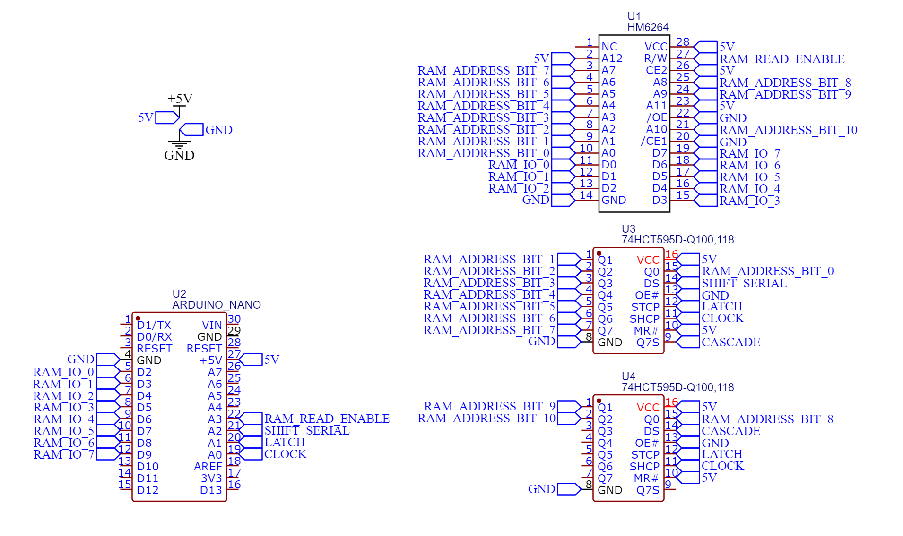
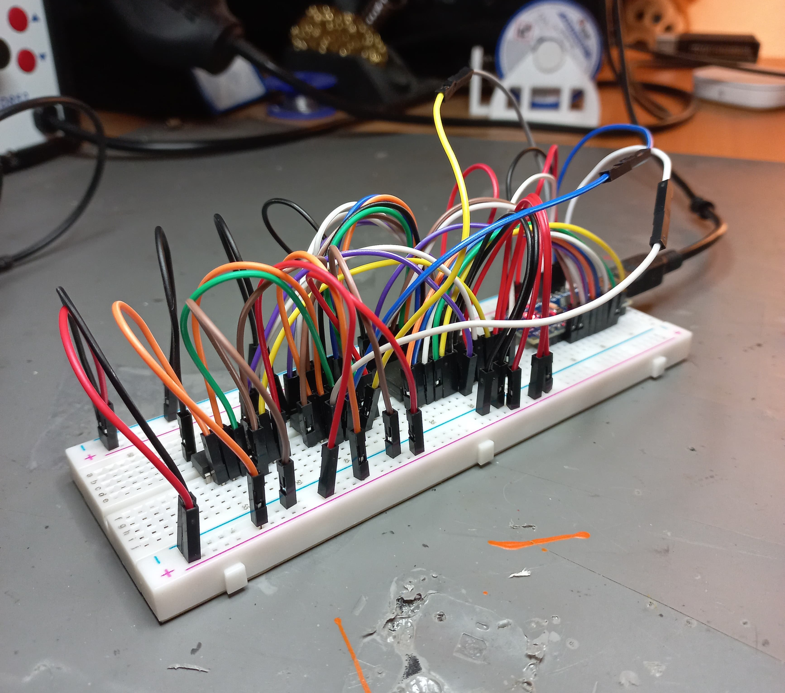

# sram_read_write

This project features a simple circuit where SRAM is connected with Arduino Nano to extend it's memory. The code found here performs SRAM write and read cycle check for errors. If no errors found, built-in LED gets turned on.

# Circuit

To use less pins on Nano, two shift registers are additionally required for SRAM memory addressing.
For education purposes only 2KB out of available 8KB of RAM are used. Addresses from 0x1800 to 0x1FFF are used, so pins A11 and A12 on SRAM chip are pulled up.

# Code

There are two folders containing code that does the same thing. One is written in C++ (found in `cpp_solution/src/main.cpp`), and the other is written in C (found in `c_solution/src/main.c`).
